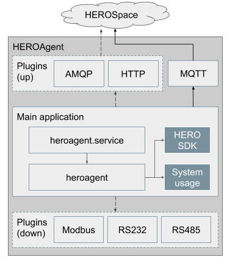

Introduction
------------

An agent service for monitoring system usage, board information and external sensor data (such as cpu usage, fan speed), connecting those data to HEROSpace in linux based operating system.
The system data is reorganized in json format and HEROAgent is communicate with HEROSpace based on MQTT protocol.
With this agent, user can easily monitoring device hw and system status on network anytime, anywhere.

Architecture
------------

HEROAgent includes two parts. One is the main part for collecting basic board data, data uploading and service control. The Sencond part is plugin configuration for other uploading protocol and external sensor data collection.

* Main Application
    1. Data collecting : board hw information from HEROSDK (voltage, cpu temperature, … ) and system usage
    2. Configuration : data updating frequency
    3. System manager : system controlled by linux systemd
    4. Data updating : by MQTT protocol
    5. Device registering : board need to register to server first for device management on server
    6. Plugin : addictional data uploading protocol and external sensor data collecting

* Plugins
    1. Additional data uploading protocol.
    2. Additional external sensor data.

.. csv-table::
    :header: "Plugin", "Description"
    :widths: 10, 30

    "HTTP", "Data uploading thourgh HTTP"
    "AMQP", "Data uploading thourgh AMQP protocol"
    "RS232/RS485", "Collecting external sensor data through RS232/RS485"
    "Modbus", "Collecting external sensor data throught modbus protocol"

Requirement
------------
* Hardware Requirement
    * 9th Generation Intel Core, Pentium Gold, Celeron, and Xeon formerly Coffee Lake
    * 8th Generation Intel Core, Pentium Gold, and Celeron formerly Whiskey Lake
    * Intel Pentium Silver and Celeron formerly Gemini Lake
* OS Support list
	Ubuntu, Debian, Fedora, CentOS, OpenSUSE

How to install
--------------
Please follow below steps to install HEROAgent:

1. Copy HEROAgent_v1.0.0.zip file
2. Unzip package::

    $ unzip HEROAgent_v1.0.0.zip && cd HEROAgent_v1.0.0/

3. Run install.sh for installing HEROAgent::

    $ sudo ./install.sh

4. Check if HEROAgent install successfully::

    $ systemctl status heroagent

