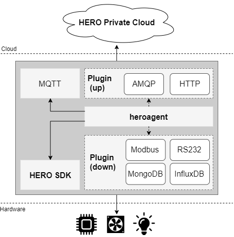

Introduction
------------

An agent service for monitoring system usage, board information and internal sensor data (such as cpu usage, fan speed from `HEROSDK <https://www.aaeon.com/en/ac/aaeon-hero-sdk>`_), connecting those data to **HEROSpace** in linux based operating system.
The system data is reorganized in **json format** and **HEROAgent** is communicate with **HEROSpace** based on **MQTT protocol**.
With this agent, user can easily monitoring device hw and system status on network anytime, anywhere.

Architecture
------------

**HEROAgent** includes two parts. One is the main part for collecting basic board data, data uploading and service control. The Sencond part is plugin configuration for other uploading protocol and external sensor data collection.

* Main Application:

    1. Data collecting : board hw information from `HEROSDK <https://www.aaeon.com/en/ac/aaeon-hero-sdk>`_ (voltage, cpu temperature, … ) and system usage
    2. Configuration : data updating frequency
    3. System manager : system controlled by linux systemd
    4. Data uploading : default using **MQTT protocol**
    5. Device registering : board need to register to server first for device management on server
    6. Plugin : addictional data uploading protocol and external sensor data collecting

* Plugins:

    1. Additional data uploading protocol.
    2. Additional external sensor data.

.. csv-table::
    :header: "Plugin", "Description"
    :widths: 10, 30

    "HTTP", "Data uploading thourgh HTTP"
    "AMQP", "Data uploading thourgh AMQP protocol"
    "RS232/RS485", "Collecting external sensor data through RS232/RS485"
    "Modbus", "Collecting external sensor data throught modbus protocol"
    "InfluxDB", "Collction external data from database"
    "MongoDB", "Collction external data from database"

Requirement
------------
* Hardware Requirement:

    1. 9th Generation Intel Core, Pentium Gold, Celeron, and Xeon formerly Coffee Lake
    2. 8th Generation Intel Core, Pentium Gold, and Celeron formerly Whiskey Lake
    3. Intel Pentium Silver and Celeron formerly Gemini Lake

* Software Requirement:

    1. MQTT: mosquitto package
    2. JSON: jq package

OS Support list
----------------
	Ubuntu, Debian, Fedora, CentOS, OpenSUSE

How to install
--------------
Please follow below steps to install HEROAgent(Sample):

#. Download HEROAgent_lite_v1.0.0.zip from :download:`here <install/HEROAgent_lite_v1.0.0.zip>`
#. Unzip package:

.. code-block:: shell

    $ unzip HEROAgent_lite_v1.0.0.zip
    $ cd HEROAgent_lite_v1.0.0/

#. Run install.sh for installing HEROAgent(Sample):

.. code-block:: shell

    $ sudo ./install.sh

#. Check if HEROAgent(Sample) installed successfully:

.. code-block:: shell

    $ systemctl status heroagent_lite
    ● heroagent_lite.service - Run agent to report hw monitor
        Loaded: loaded (/etc/systemd/system/heroagent_lite.service; enabled; vendor preset: enabled)
        Active: active (running) since Tue 2019-11-19 16:24:30 CST; 2min 20s ago
      Main PID: 25896 (heroagent_lite)
         Tasks: 3 (limit: 4915)
        CGroup: /system.slice/heroagent_lite.service
                ├─11508 /bin/bash /usr/bin/heroagent_lite
                ├─11510 herosuit --sensor
                ├─11728 /bin/bash /usr/bin/heroagent_lite
                └─25896 /bin/bash /usr/bin/heroagent_lite

#. Using below command to listen data sent from HEROAgent(Sample):

.. code-block:: shell

    $ mosquitto_sub -t "hmi/#"
    {"hwm":[{"ext":0,"name":"Cpu0","type":7,"value":20},{"ext":0,"name":"Cpu1","type":7,"value":0},{"ext":0,"name":"Cpu2","type":7,"value":0},{"ext":0,"name":"Cpu3","type":7,"value":20},{"ext":0,"name":"Cpu4","type":7,"value":16.67},{"ext":0,"name":"Cpu5","type":7,"value":33.33},{"ext":0,"name":"Cpu6","type":7,"value":20},{"ext":0,"name":"Cpu7","type":7,"value":0},{"ext":0,"name":"memory","type":8,"value":38.73},{"ext":0,"name":"/","type":10,"value":92},{"ext":0,"name":"/boot/efi","type":10,"value":1},{"ext":0,"name":"CPU Temp","type":1,"value":0},{"ext":0,"name":"SYS Temp","type":1,"value":0},{"ext":0,"name":"3.3V","type":2,"value":0},{"ext":0,"name":"VBat","type":2,"value":0},{"ext":0,"name":"5V","type":2,"value":0},{"ext":0,"name":"12V","type":2,"value":0},{"ext":0,"name":"Vcore","type":2,"value":0},{"ext":0,"name":"Vmem","type":2,"value":0},{"ext":0,"name":"CPU Fan Speed","type":3,"value":0},{"ext":0,"name":"SYS Fan Speed","type":3,"value":0},{"ext":0,"name":"brightness 1","type":4,"value":-1}],"ts":1574144316110,"uuid":"11111111-2222-3333-4444-555555555555","ver":"2.1.0"}
    ...

